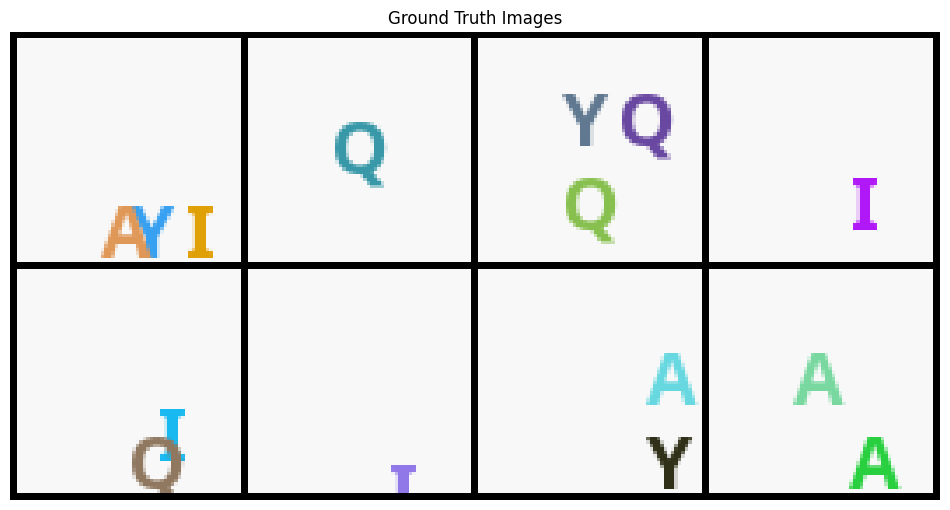

# Alphabet Dataset: Synthetic Text-to-Image Dataset

A Python package for generating synthetic datasets of images containing multiple letter shapes with various colors and positions. Perfect for testing text-conditional diffusion models.

## Example Output

<p align="center">
  
</p>

This package generates synthetic images with letter shapes that can be used for training and testing text-to-image models. Each image contains a configurable number of letter shapes with various colors and positions.


## Features

- Generate images with multiple letter shapes (A-Z)
- Customizable image size and number of shapes
- Random background and shape colors
- Precise shape positioning with bounding boxes
- Built-in visualization tools
- Streamlit-based interactive viewer

## Installation

You can install from source:

```bash
git clone https://github.com/fal-ai-community/alphabet-dataset
cd alphabet-dataset
pip install -e .
```

Or simply:

```bash
pip install git+https://github.com/fal-ai-community/alphabet-dataset
```

## Quick Start

```python
from syntht2i import ShapeDataset

# Create a dataset
dataset = ShapeDataset(
    length=1000,        # Number of images
    image_size=256,     # Image size (square)
    max_shapes=3,       # Maximum shapes per image
    seed=42            # Random seed for reproducibility
    nocolor=True      # White Background
)

# Get a single sample
image, params = dataset[0]
print(f"Image shape: {image.shape}")  # [3, 256, 256]

# Decode parameters to human-readable format
decoded = dataset.decode_params(params)
print("Image parameters:", decoded)

# Visualize a sample
dataset.visualize_sample(0)

# Use with PyTorch DataLoader
from torch.utils.data import DataLoader

dataloader = DataLoader(dataset, batch_size=32, shuffle=True)
```

## Dataset Format

Each sample consists of:

- **x**: RGB image tensor of shape [3, H, W]
- **y**: Parameter tensor containing:
  - Background color (RGB)
  - For each shape:
    - Shape type (shape encoding of letter A-Z)
    - Position (x1, y1, x2, y2)
    - Color (RGB)

# For 2025 Contest

You can use cached parameters as it takes some time to generate them and might hurt the experiment cycle.

```python
from syntht2i import ShapeDataset

valset = ShapeDataset(
    length=100,
    image_size=64,
    max_shapes=3,
    seed=0,
    nocolor=True,
    granularity=8,
    download_url="https://github.com/fal-ai-community/alphabet-dataset/raw/refs/heads/main/contest_param/2025contest_validationsetparams.pt"
)

trainset = ShapeDataset(
    length=100000,
    image_size=64,
    max_shapes=3,
    seed=42,
    nocolor=True,
    granularity=8,
    download_url="https://github.com/fal-ai-community/alphabet-dataset/raw/refs/heads/main/contest_param/2025contest_trainsetparams.pt"
)
```

## License

This project is licensed under the MIT License - see the LICENSE file for details.
